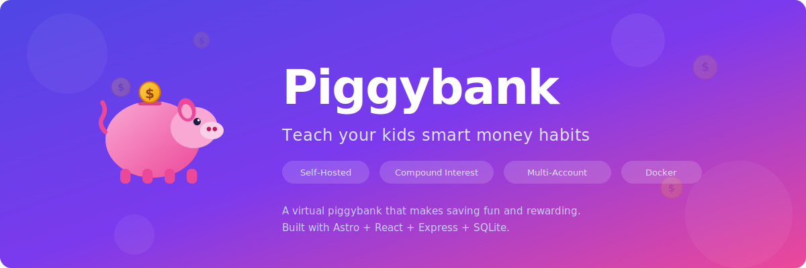

<p align="center">
  
</p>

<p align="center">
  <strong>A self-hosted virtual piggybank that makes saving fun — and teaches real financial skills.</strong>
</p>

<p align="center">
  <a href="#quick-start-docker"></a>
  <a href="#features"></a>
  <a href="LICENSE"></a>
</p>

---

Kids learn by doing. Piggybank gives them a hands-on way to **deposit allowances, track spending, and watch compound interest grow their balance over time** — all from a simple, friendly interface you host yourself.

No ads. No subscriptions. No third-party data collection. Just a straightforward tool for building money habits that last.

## Why Piggybank?

Most "kids finance" apps are designed to sell something. Piggybank is different:

- **You own the data.** Everything lives in a single SQLite file on your server. No cloud accounts, no vendor lock-in.
- **Interest that actually teaches.** Configure real compound interest rates and let your kids see their balance grow — daily, weekly, or monthly. It's one thing to explain compound interest; it's another to watch it work.
- **Built for families.** Create separate accounts for each child, categorize transactions (Allowance, Tooth Fairy, Chores, Gifts), and let kids see exactly where their money comes from and goes.
- **Deploy in 60 seconds.** One `docker-compose up` and you're running. No databases to configure, no environment variables to wrangle.

## Features

<table>
<tr>
<td width="50%" valign="top">

### Multi-Account Management
Create individual accounts for each child. Each account tracks its own balance, transaction history, and interest settings independently.

### Transaction Tracking
Record deposits and withdrawals with categories like **Allowance**, **Tooth Fairy**, **Gift**, **Chore**, **Toy**, **Candy**, and **Savings Goal**. Add notes for context. Edit or remove entries anytime — balances recalculate automatically.

### Compound Interest Engine
Set a custom APY and compounding period (daily, weekly, monthly, quarterly, or annually) per account. Interest is calculated and credited automatically — kids can even see predictions for their next payout.

</td>
<td width="50%" valign="top">

### Account Statistics
At a glance: current balance, total deposits, total withdrawals, lifetime interest earned, account age, and next interest payment estimate.

### Automated Backups
Daily backups run at 2:00 AM with 30-day retention. Your data is always recoverable.

### Simple, Friendly UI
Clean design built with Astro, React, and Tailwind CSS. Large text, clear buttons, and a color-coded interface (green for deposits, red for withdrawals) that kids can navigate on their own.

</td>
</tr>
</table>

## Quick Start (Docker)

```bash
git clone https://github.com/JoelLewis/piggybank.git
cd piggybank
docker-compose up -d --build
```

Open [http://localhost:3000](http://localhost:3000) and create your first account.

> **That's it.** The backend API runs on port 4000, the frontend on port 3000. Data is stored in `./data/piggybank.db` and persists across restarts.

## How It Works

```
┌─────────────────────────────────────────────────────────────┐
│  Browser (localhost:3000)                                    │
│  ┌───────────────┐  ┌──────────────┐  ┌──────────────────┐ │
│  │  Dashboard     │  │  Account     │  │  Transaction     │ │
│  │  (All Kids)    │→ │  Details     │→ │  History         │ │
│  └───────────────┘  └──────────────┘  └──────────────────┘ │
└──────────────────────────┬──────────────────────────────────┘
                           │ API Proxy
┌──────────────────────────▼──────────────────────────────────┐
│  Backend (localhost:4000)                                    │
│  ┌──────────┐  ┌───────────────┐  ┌──────────────────────┐ │
│  │ Accounts │  │ Transactions  │  │ Interest Calculator  │ │
│  │ API      │  │ API           │  │ (Daily Cron Job)     │ │
│  └────┬─────┘  └───────┬───────┘  └──────────┬───────────┘ │
│       └────────────────┬┘                     │             │
│                   ┌────▼─────────────────────▼┐            │
│                   │  SQLite (./data/)          │            │
│                   └───────────────────────────┘            │
└─────────────────────────────────────────────────────────────┘
```

## Tech Stack

| Layer | Technology |
|-------|-----------|
| **Frontend** | [Astro](https://astro.build) + [React](https://react.dev) + [Tailwind CSS](https://tailwindcss.com) + TypeScript |
| **Backend** | [Express](https://expressjs.com) (Node.js) |
| **Database** | SQLite |
| **Icons** | [Lucide](https://lucide.dev) |
| **Deployment** | Docker (multi-stage build, Alpine Linux) |

## Development Setup

<details>
<summary><strong>Backend</strong></summary>

```bash
cd backend
npm install
npm run start        # production
npx nodemon server.js  # development (hot-reload)
```

Runs on `http://localhost:4000`.

</details>

<details>
<summary><strong>Frontend</strong></summary>

```bash
cd frontend
npm install
npm run dev
```

Runs on `http://localhost:3000`.

</details>

## Deployment

### Docker Compose (Recommended)

The included `docker-compose.yml` handles everything. Data persists in `./data/`:

```yaml
volumes:
  - ./data:/app/data   # Database + backups
```

### Proxmox LXC

1. Create a standard LXC container (Debian/Ubuntu)
2. Install Docker and Docker Compose inside the LXC
3. Clone this repo and run `docker-compose up -d --build`
4. (Optional) Put a reverse proxy (Caddy, Nginx, Traefik) in front for HTTPS

## Data & Backups

| What | Where |
|------|-------|
| Database | `./data/piggybank.db` |
| Backups | `./data/backups/piggybank_backup_YYYYMMDD_HHMMSS.db` |
| Schedule | Daily at 2:00 AM, 30-day retention |

**Manual backup:**

```bash
docker-compose exec backend sqlite3 /app/data/piggybank.db \
  ".backup /app/data/backups/manual_$(date +%Y%m%d_%H%M%S).db"
```

**Restore from backup:**

```bash
docker-compose down
cp data/backups/piggybank_backup_YYYYMMDD_HHMMSS.db data/piggybank.db
docker-compose up -d
```

## Upgrading

```bash
git pull origin main
docker-compose down
docker-compose up -d --build
```

Schema migrations run automatically on startup. Your data is preserved.

## Roadmap

- [ ] Parental PIN protection for withdrawals and settings
- [ ] Savings goals with progress tracking
- [ ] Charts and visual spending/saving insights
- [ ] Recurring transactions (weekly allowance)
- [ ] Multi-family / user authentication

## License

[MIT](LICENSE) — use it however you like.
